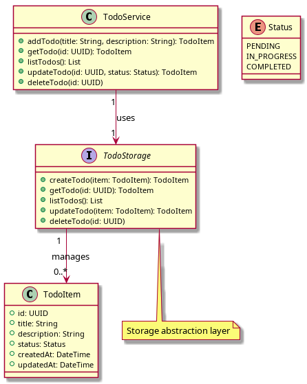

<h1>Like vibe-coding, but bulletproof and trustworthy</h1>

- [What is this all about?](#what-is-this-all-about)
- [What is SysML?](#what-is-sysml)
- [What is MBSE?](#what-is-mbse)
- [Example: a simple web service](#example-a-simple-web-service)
  - [Making UML diagrams](#making-uml-diagrams)
- [Using an LLM to implement the design](#using-an-llm-to-implement-the-design)
  - [1. REST API Service](#1-rest-api-service)
  - [2. Microservice Architecture](#2-microservice-architecture)
  - [3. Serverless Implementation](#3-serverless-implementation)
  - [4. Desktop/Mobile Application](#4-desktopmobile-application)
  - [5. Database-Centric Implementation](#5-database-centric-implementation)
  - [6. Event-Driven Architecture](#6-event-driven-architecture)

## What is this all about?

As software developers, we have no viable choice but to embrace
AI-assisted software design and development. What follows is my
attempt to come up with a process that produces bulletproof,
trustworthy designs and code.

The LLM is great at generating code quickly, but it can hallucinate
and make mistakes, so I want a process that minimizes bugs and errors
while letting the LLM play to its strength. This is a work in process,
and I'm not yet at the final answer.

When one starts using AI assistance, the language model very quickly
produces a large, complex design. A detailed review of the design
would take a long time, much longer than it took to generate the
code.

My first thought was to try a test-driven development (TDD) process.
The AI can help write the tests, and then the code can be written to
pass the tests. Reviewing the tests would hopefully be more intuitive
and straightforward than reviewing the functional design. Passing the
tests would give confidence that the design is correct.

What I'm doing right now is that I give the LLM a natural language
description of the system I want to build. I then ask it to generate
a SysML model of the system. I review the model to make sure it looks
good. I might make changes at this point.

I then ask it to generate an implementation of the system. This might
be in Python or Rust or some other language. I review the code in a
superficial way, there is usually too much code to review in detail.
But I might learn something about the implementation that helps me
understand the design better, which may then result in changes to the
SysML model, and I go back around the loop. Since this process is
pretty quick, I may generate implementations in different languages
to see how they compare. Perhaps a Rust implementation will show me
something I want to change in the design, even though I'm aiming for a
Python implementation.

I then ask the LLM to generate a test suite for the system. I request
that tests should be

- comprehensive
- well-documented
- easy to understand
- independent of one another (can run in any order)
- fast to run

Review of the tests needs to be done more carefully. These are going
to be the safety net for my on-going development efforts. They will
also become the documentation for the system. They should provide usage
examples that could be the beginning of a quickstart guide.

Having reviewed the tests and generated a functional implementation that
passes the tests, I can now ask the LLM to clean up the code to make it
easier to review and more maintainable in general. Something like this
appears to work well in Cursor IDE:

> I want to go thru all the functional and test code, and make sure it's
> all super easy for a human to review. Ample comments, make sure
> everything is clear, and point out any duplications or other bad
> code smells or architectural flaws.

## What is SysML?

SysML (Systems Modeling Language) is a precise modeling language for
systems engineering that can be expressed in both graphical and textual
forms. In its textual format, SysML v2 uses a straightforward syntax to
describe:

- System structure (parts and how they connect)
- System behavior (actions and flows)
- Requirements (what the system must do)
- Parametric constraints (mathematical relationships)

SysML is agnostic to what programming language is used to implement
the system.

Here's a simple example of textual SysML describing a coffee maker:

---

<details>
<summary><tt>coffee_maker.sysml</tt></summary>

```sysml
package CoffeeMaker {
    // Define reusable component types (like classes)
    part def WaterTank {
        // Physical properties
        attribute capacity : Real;
        attribute currentLevel : Real;
        
        // Ports for connections
        port water_out;
        
        // Constraints
        constraint { currentLevel <= capacity }
    }
    part def HeatingElement;
    part def BrewingUnit;
    
    // Define the system and its connections
    part coffee_maker {
        // Create instances of the component types (like objects)
        part water : WaterTank {
            attribute capacity = 1.5; // liters
        }
        part heater : HeatingElement;
        part brewer : BrewingUnit;
        
        // Define the flow of water through the system
        flow water -> heater;
        flow heater -> brewer;
    }
}
```

</details>

---

This textual representation makes it easy to version control your system models and integrate them into your development workflow, similar to how you manage source code. Unlike UML diagrams, textual SysML can be diffed, merged, and reviewed using standard development tools.

## What is MBSE?

MBSE (Model-Based Systems Engineering) is a methodology for using SysML
to design and validate systems. It enables engineers to create executable
models that simulate system behavior, verify requirements, and validate
designs prior to physical implementation. Various MBSE tools support SysML:

- [Eclipse Papyrus](https://www.eclipse.org/papyrus/) (open source)
- [Capella](https://www.eclipse.org/capella/) (open source)
- [IBM Rhapsody](https://www.ibm.com/products/rhapsody) (commercial)
- [Dassault Systemes ENOVIA](https://www.3ds.com/en/products/enoova/overview)
  (commercial)

With Papyrus, you can export models to XMI format and use custom solutions
to bridge between Papyrus and Visual Studio. Some users create workflows
where they generate code in Papyrus that is then imported into Visual
Studio projects.

Examples of functional models that can be created with these tools include:

- **Behavioral Simulations**: Models that simulate how systems respond
  to inputs, allowing engineers to verify system behavior against requirements
- **Performance Analysis Models**: Simulations that analyze system
  performance metrics like throughput, response time, and resource utilization
- **Monte Carlo Simulations**: Probabilistic models that account for
  uncertainty and variability in system parameters
- **Digital Twins**: Virtual representations of physical systems that
  can be used to predict system behavior and optimize performance

These functional models provide executable simulations that can validate
system designs, optimize performance parameters, and identify potential
issues before implementation begins.

## Example: a simple web service

Let's say we want to design a simple web service that can be used to
manage a todo list. We can start by sketching out a block diagram of
the system. `todo.sysml` is a simple block diagram of the system in
SysML. This gives us a starting point with:

- Core domain entities
- Basic operations
- Key relationships
- Standard tracking fields

---

<details>
<summary><tt>todo.sysml</tt></summary>

```sysml
package todo {
    part def TodoService {
        operations {
            action addTodo {
                in title: String;
                in description: String;
                out result: TodoItem;
            }
            action getTodo {
                in id: UUID;
                out result: TodoItem;
            }
            action listTodos {
                out result: List;
            }
            action updateTodo {
                in id: UUID;
                in status: Status;
                out result: TodoItem;
            }
            action deleteTodo {
                in id: UUID;
            }
        }
    }

    part def TodoItem {
        attributes {
            id: UUID;
            title: String;
            description: String;
            status: Status;
            createdAt: DateTime;
            updatedAt: DateTime;
        }
    }

    enum Status {
        PENDING;
        IN_PROGRESS;
        COMPLETED;
    }

    /* Storage abstraction layer */
    interface def TodoStorage {
        action createTodo {
            in item: TodoItem;
            out result: TodoItem;
        }
        action getTodo {
            in id: UUID;
            out result: TodoItem;
        }
        action listTodos {
            out result: List;
        }
        action updateTodo {
            in item: TodoItem;
            out result: TodoItem;
        }
        action deleteTodo {
            in id: UUID;
        }
    }

    /* Service uses storage */
    association {
        end service: TodoService[1];
        end storage: TodoStorage[1];
    }

    /* Items are managed by storage */
    association {
        end storage: TodoStorage[1];
        end items: TodoItem[0..*];
    }
}
```

</details>

---

### Making UML diagrams

PlantUML is a tool that can generate diagrams from SysML models. To
get there we need an intermediate representation. The input language
for PlantUML is called [PUML](https://plantuml.com/puml).

The easiest way to get there is to ask Claude.AI to convert the SysML
model to PUML. My prompt was very simple, and I copied the result
into `todo.puml`.

> Please convert this to PlantUML so I can generate UML diagrams.

Alternatively, the AI assistant in Cursor IDE can perform the
conversion for us. We want to ensure that the SysML model is the
only source of truth for the design.

Then we can use `todo.puml` to generate a UML diagram:

```bash
sudo apt install plantuml
plantuml todo.puml > todo.png
```



## Using an LLM to implement the design

I handed `todo.sysml` to Claude.AI and asked about implementation.
It offered several options:

### 1. REST API Service

You could implement this as a RESTful web service with endpoints that map directly to your operations:
- `POST /todos` for `addTodo`
- `GET /todos/{id}` for `getTodo`
- `GET /todos` for `listTodos`
- `PUT /todos/{id}` for `updateTodo`
- `DELETE /todos/{id}` for `deleteTodo`

This would work well with frameworks like Spring Boot (Java), Express.js (Node.js), Django/Flask (Python), or ASP.NET Core (C#).

### 2. Microservice Architecture

Your TodoService could be implemented as a standalone microservice, potentially with:
- A separate database for storing TodoItems
- Message queue integration for async operations
- API gateway for client interaction
- Service discovery and configuration management

### 3. Serverless Implementation

The operations could be mapped to serverless functions (AWS Lambda, Azure Functions, Google Cloud Functions):
- Each action becomes a separate function
- DynamoDB or similar for storing TodoItems
- API Gateway to expose endpoints

### 4. Desktop/Mobile Application

You could create a standalone desktop or mobile app:
- Local database for TodoItems (SQLite, Realm, etc.)
- GUI components corresponding to each operation
- Local notifications for due dates or status changes

### 5. Database-Centric Implementation

A database-first approach where:
- TodoItems are stored in a table/collection
- Operations are implemented as stored procedures or ORM methods
- Business logic lives close to the data

### 6. Event-Driven Architecture

An event-based system where:
- Actions publish events (TodoCreated, TodoUpdated, etc.)
- Services subscribe to relevant events
- Event store maintains history of all changes
